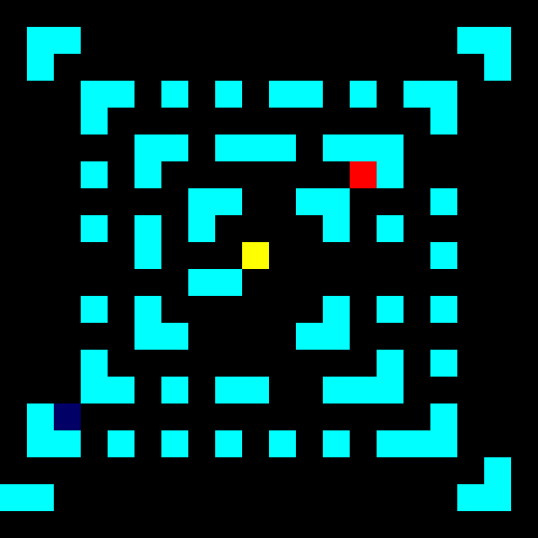

# Fuga Escorregadia | Slippery Escape

## Jogue [aqui](https://awvalenti.github.io/fugaescorregadia)! | Play [here](https://awvalenti.github.io/fugaescorregadia)!

[](https://awvalenti.github.io/fugaescorregadia)

***Slippery Escape*** is a labyrinth game that runs on the browser.

You can play it anywhere: computer, mobile phone, tablet and so on.

It is work in progress and feedback is welcome! You can
[open an issue](https://github.com/awvalenti/fugaescorregadia/issues/new)
and tell me what you think.

## Technical stuff
Slippery Escape runs on web technologies: HTML, CSS and JavaScript.

Internally, it is written in [CoffeeScript](https://coffeescript.org), a
nice language that compiles to JavaScript.

## Development

Tools include:
- `ParcelJS`: creates development server and generates distribution package.
  Fast alternative to [webpack](https://webpack.js.org/).
- `Babel`: translates new JavaScript code to older versions
- `Mocha`: automated testing
- `NodeJS`: JavaScript runtime, runs many development tools
- `VSCode`: awesome editor

To run Slippery Escape on development mode, you basically need to:
- Have NodeJS installed
- Clone this repository
- Run `npm install` and any of these commands:

```
npm test          # Automated tests on Node.js
npm run tdd       # Automated tests on browser
npm run autoplay  # Simple system test on browser
npm start         # Play game
npm run editor    # Run level editor
```

## Licence
Copyright &copy; 2019, André Willik Valenti. All rights reserved.

### Open-source with all rights reserved?
Yes, that's possible! More details
[here](http://choosealicense.com/no-license).
Long story short, you can only do stuff other than see the code
and run the project if you get
permission from me. If you're interested in that, please contact me by
[opening an issue](https://github.com/awvalenti/fugaescorregadia/issues/new).

## Old README

[Here](docs/README.old.md)
